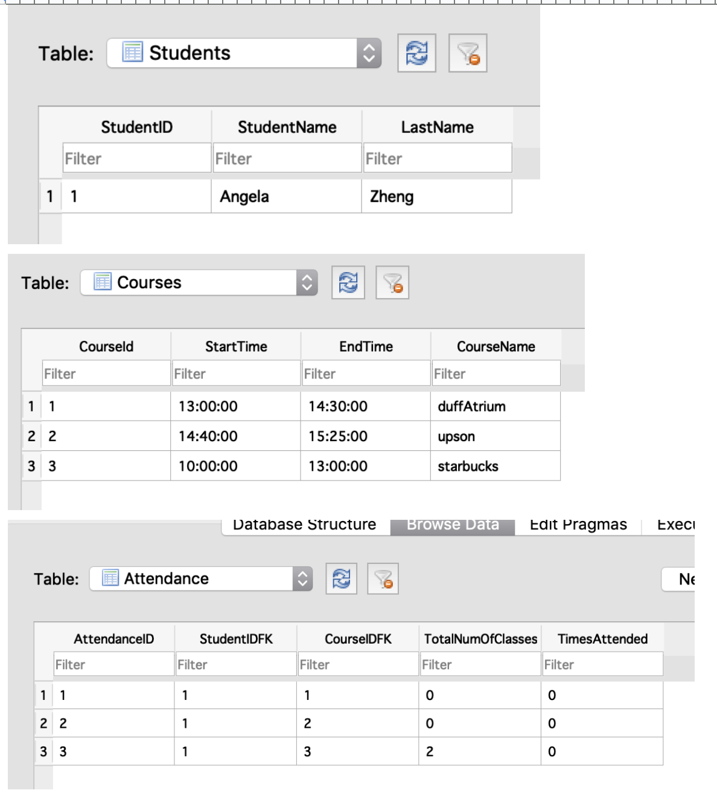
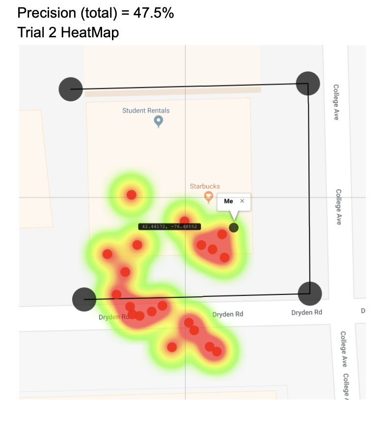
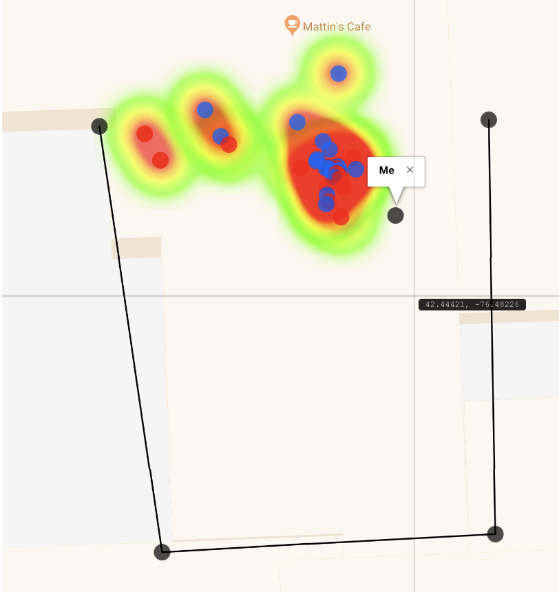

# Final Project for Ubiquitous Computing
My class partner (net ID: tea42 ) and I developed AttendanceTracker as our final project using ubiquitous development concepts. 

The following excerpts were extracted from the submitted final paper. 

## Purpose
AttendanceTracker is an Android application that ubiqutously logs student attendacen when the Android device is within the location parameters of the intended class. The application uses GPS and Network Provider location tracking to obtain the device location, then uses a ray casting algorithm to determine if the device is in the proper section of the building where the classroom is located. The device's attendance data is saved locally as a table using SQLite. 

## Methodology 
### System Design Frame: 
AttendanceTracker is as follows: users install a version of AttendanceTracker on their phone where all of their class locations and times are already hard-coded, when users arrive in class, all they have to do is open the app which will then automatically check if the user is in the correct location and save this information to a table, this table can then be accessed from the phone’s files to be viewed and analyzed by professors. 

### Android:
AttendanceTracker was developed from scratch using publicly available libraries, including Android’s built-in location service for GPS location tracking. There exists MainActivity, GoogleService, Student, ClassRoom, dbHandler classes within the application. MainActivity sets the user interface and runs GoogleService, which returns location information based on GPS provider, or Network Provider if GPS is not available. GPS Provider is preferred to Network Provider as it is often regarded as more accurate; however, it does have its limitations when indoors as physical objects, such as buildings or walls can obstruct signal strength (https://developer.android.com/guide/topics/location/strategies). Student and ClassRoom classes were constructed for populating the database that was created with dbHandler. The ClassRoom class contains information about courses including the four coordinates that make up the polygon used to reference whether or not the user is within the building. 
The interface of the application informs the user of his or her next upcoming class, the number of classes they have missed since installing the application, if they should be in a class at that moment, and logs them into class automatically if they are within range of the room by updating the “Attendance” table in the database. 

### Database: 
A database was constructed within Android Studio inside the dbHandler class. The schema consists of three different tables for “Students,” “Courses,” and “Attendance.” The “Students” table includes information on student ids, which is unique to each student, first names, and last names. The “Courses” table contains data on course identifiers, start times, end times, and course names. Lastly, the “Attendance” table combines information from the “Students” and “Courses” table so that each record contains two foreign keys: one for student ID and the other four course ID to link the courses to students as one course can contain many students and one student can take multiple courses. For the purposes of this application, we have seeded the information in the table with only one student taking three courses. Other columns within the “Attendance” table includes the total number of classes that have occurred since the application was installed and the total number of classes that the student attended. 

Data within the database is obtained through queries and populated into the Android interface as needed. For instance, the “Start Time” and “End Time” columns within the “Courses” table can be used to determine whether or not a student currently has a class at the current time. In addition, the “Attendance” table can be used to determine the attendance rate for a specific class or that of a specific student based on the queries used to select information from the table. Not all potential queries were used in this implementation of the application, but the current schema allows for scalability and opportunities for future usage.  

### Ray Casting Algorithm:
We use a typical implementation of the ray casting algorithm to determine whether or not a specific set of Latitude, Longitude coordinates are within the boundaries of a designated section of a building. The algorithm describes how a polygon can be made with a set of at least three coordinates. A ray from the location in question is cast in any direction and checked to see if it intersects with any of the generated polygon’s edges; if the ray crosses an odd number of edges, then the point is within the polygon, otherwise the point lies outside of the polygon. The coordinates used to create the polygons representing different sections of buildings were gathered using a web application made by Headwall Photonics which is accurate up to fourteen decimal points. The only shortcoming of using the ray casting algorithm to determine users’ locations is that when users are very close to the boundaries of the generated polygon that they are currently residing in, rounding errors, resulting from the use of floating point numbers to represent the user’s and polygon’s coordinates, may cause the algorithm to mistakenly calculate that the user is not in the correct location. However, this is easily fixed by simply “oversizing” the polygons we construct. (https://rosettacode.org/wiki/Ray-casting_algorithm). 

### GPS and Network Provider:
AttendanceTracker determines a user’s location using one of two methods. It first uses GPS location as calculated by a built-in location service for Android with the usual method of trilateration using the radio signals broadcast by orbiting GPS satellites. If GPS is unavailable, a rare occurrence, then the network provider location service is used which determines location based on availability of cell tower and WiFi access points and retrieves results by means of a network lookup. GPS location is used first over the Network Provider location since it is more accurate, as stated in Android development documentation. We initially planned on having the GPS and Network Provider location services track the user’s location simultaneously and check that the resulting locations calculated by each are nearly equivalent so as to prevent students from manually changing their phone’s GPS location to trick our system. However, upon discovering that simultaneously running these services drains the phone battery at an alarming rate, in addition to the fact that manually changing one’s GPS location is still a higher barrier for cheaters than any barrier presented by traditional attendance taking methods, we decided that using GPS as our primary location service and Network Provider as a backup was a more elegant solution. 

## Testing Procedures
Application accuracy was tested on the basis of whether or not the program is able to correctly identify whether or not the user was at the right location at the right time for a “class.” Originally, individual classrooms were selected to test; however, initial testing illustrated an astounding lack of accuracy. As a result, larger building sections were selected instead. A class schedule and student information was hard coded into the program to make the testing process more efficient. In this case, the student had to be at the collegetown Starbucks from 10:00 AM to 1:00 PM, the Duffield Atrium from 1:oo PM to 2:30 PM, and Upson from 2:40 PM to 3:25 PM. Latitude and longitude coordinates were selected using a web application made by Headwall Photonics and used to construct a room reference to determine if the user’s location is within the building.

For each “class” building, two trials were conducted with 20 runs of the program while inside the confines of the selected coordinates. Each run recorded the True/False value of whether the identified location was within the space as well as the latitude, longitude coordinates the phone picked up. These coordinates were plotted onto a visual map using another website (darrinward.com/lat-long). The visualizations were further developed into heatmaps to gather better understandings of location accuracy and precision. 

## Results 
Precision was calculated based on true and false positives. Recall was not calculated as trials that expected false values were not conducted due to the scale and accessibility of obtaining false values as there is a significantly greater area where one can expect false returns. The first two trials were conducted in the collegetown Starbucks, and precisions for Trial 1 and Trial 2, respectively, were: 50% and 47%. For Duffield Atrium, the values were: 90% and 100%; lastly, the Upson Hall section that was tested had values of: 30% and 15%. Starbucks point plots and heat maps illustrate the variability in the locations the application identified. This is also reflected in the Duffield and Upson plots.

## Screenshots
#### Student User Interface Screenshot 

#### Sample Databases

#### Heatmap illustrating low-precision of estimated location based on collected data. 

#### Heatmap illustrating slightly better accuracy and precision in a different location based on collected data. 

## Sources
- https://er.educause.edu/articles/2015/6/students-mobile-learning-practices-in-higher-education-a-multiyear-study
- https://blackboard.cornell.edu/bbcswebdav/pid-3900422-dt-content-rid-21947598_1/courses/17265_2018FA_COMBINED-COMEET/17265_2018FA_COMBINED-COMEET_ImportedContent_20180918091204/INFO4120%20Final%20Report%20-%20xl454%20_%20ma698.pdf
 (“Class Attendance in Undergraduate Courses.” The Journal of Psychology 126.5 (1992): 487–494. Web.) 
- http://delivery.acm.org/10.1145/1370000/1366856/a40-lee.pdf?ip=128.84.127.92&id=1366856&acc=ACTIVE%20SERVICE&key=7777116298C9657D%2EB493315FA1EC298D%2E4D4702B0C3E38B35%2E4D4702B0C3E38B35&__acm__=1544146318_bd2512ab2c9ce7d9b9f6c10e4df69e22 (Hong Kong Tech one) 
- https://developer.android.com/guide/topics/location/strategies (gps more accurate citation)
- Soo-Cheol Kim, et al. RFID-Based Indoor Location Tracking to Ensure the Safety of the Elderly in Smart Home Environments. 21 Sept. 2012.

